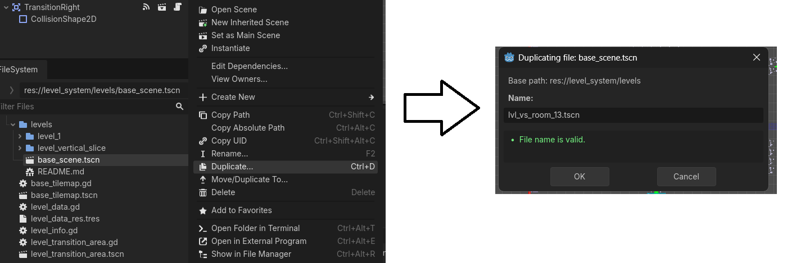
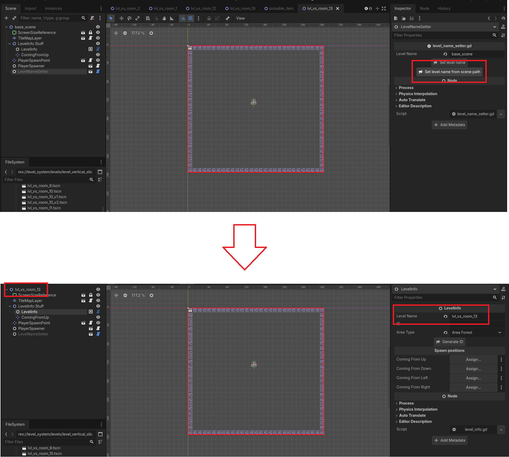
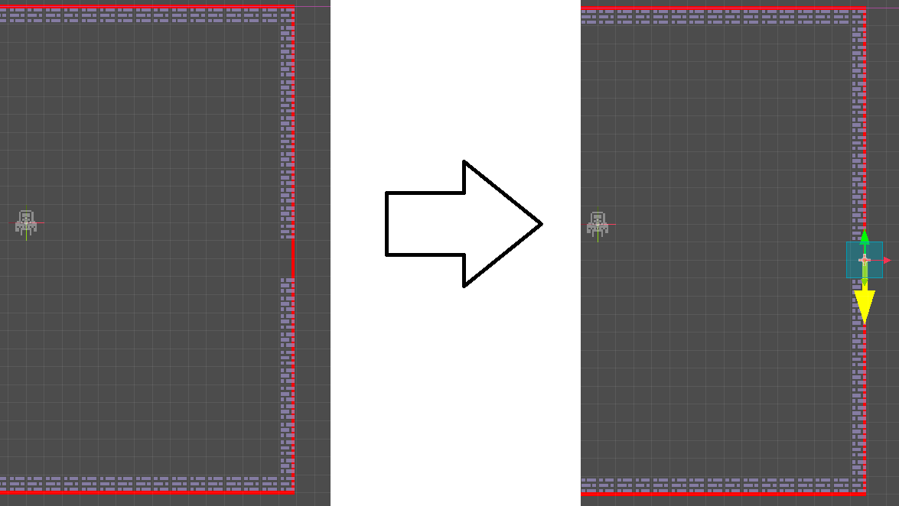
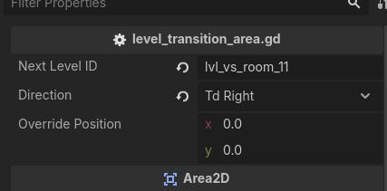
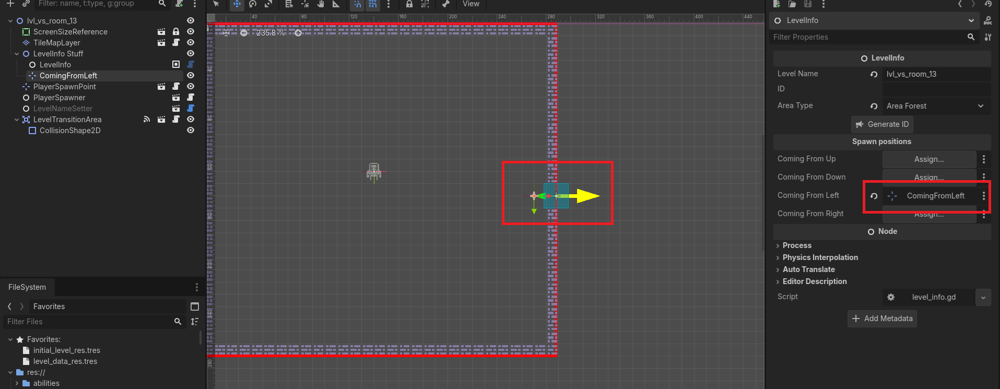

# Creating a Level

This document explains how to create levels for the game.

Levels are collections of scenes called rooms. We create levels by stringing rooms together.

For this example, we will create a level for the **vertical slice**

> Note: while a lot of files and nodes references levels, they are actually talking about rooms. Sorry for the terrible nomenclature. 

## 1. Copying the base scene

First, we create a duplicate of the [base scene](./base_scene.tscn) file, by right clicking and selecting "duplicate". 

Rooms use the following name convention:
```
lvl_[the level]_room_[number]
```



Dont forget to move the level to its corresponding folder (in this case, "vertical_slice")

> Note: vs stands for "vertical slice"

## 2. Room structure

Opening the scene will reveal a series of nodes.


### ScreenSizeReference 

Size of the screen when the game is running. Anything outside that rectangle wont be shown to the player.

### TileMapLayer

A tilemap with a tileset setup. It uses a special material that replaces the colors with a custom palette.

### LevelInfo

LevelInfo: this node contains important information about the room:

1. Level name: The name/id of the level. Will be used to transition between rooms. Its setup automatically by [REFERENCE0]
2. Area Type: indicates the color palette this room will use.
3. Spawn positions: references to Marker2D nodes, that indicate where the player should spawn, depending on the direction they enter the room from.

### PlayerSpawnPoint

Default spawn position for the player. Will be used when no spawn direction is given.

### PlayerSpawner

Node in charge of handling player spawning.

### LevelNameSetter

Utility that automates the process of naming the room.

## 3. Configuring the room.

First, select the [LevelNameSetter](#levelnamesetter) and click "Set level name from scene path". This will:

- Rename the scene to match the name of the file.
- Set the name of the file as the room id



Then, open the Command Palette with **Ctrl+Shift+a** and search "Add level to database". Executing this command will add the room to [level_data_res.tscn](../../level_system/level_data_res.tres).

> Note: rooms are referenced in other parts of the game by their name. Make sure you dont have 2 levels with the same name.

## 4. Adding a transition

Lets say i want to transition to the room on the right (called *lvl_vs_room_11*).

First, we make space on the room by removing 2 tiles. Then, we add a [LevelTransitionArea](../level_transition_area.tscn) scene and set its collision to ocuppy the free space.

> We remove 2 tiles by convention, but transitiona areas can be any size you want.



A transition area takes 2 arguments:
- Next Level ID indicates the level we want to transition to
- Direction indicates the direction we want to transition to.

In this case, we want to transition to the right, to *lvl_vs_room_11*.



#### Override position

There is an extra parameter called override position. This parameter will change the position the player spawns in the next room, ignoring the position indicated by the direction in which we are traveling.

This is mostly useful when you have multiple transitions from the same room. You can see an example of this on *lvl_vs_room_6* and *lvl_vs_room_7*

## 5. Setting up transition position

Since we can (usually) travel between rooms freely, it is recommended to set up the position the player will spawn in when they come from *lvl_vs_room_11*.

On LevelInfo, you will have a position for each direction the player can travel from. In this case, we are coming from the left room, so we add a Marker2D and set it to "Coming From Left".
We then move the marker close to the transition area.



> Note: the green arrow on the transition area indicates the directionw the player travels from the next room, which is useful to figure out which marker goes where.

## 6. Running the game

We can see the room ingame by opening the Command Palette with **Ctrl+Shift+a** and executing "Run Current Level".

> Running the scene itself is not recommended, as the scene doesnt match the game resolution, and most systems wont be available, which may lead to errors.

