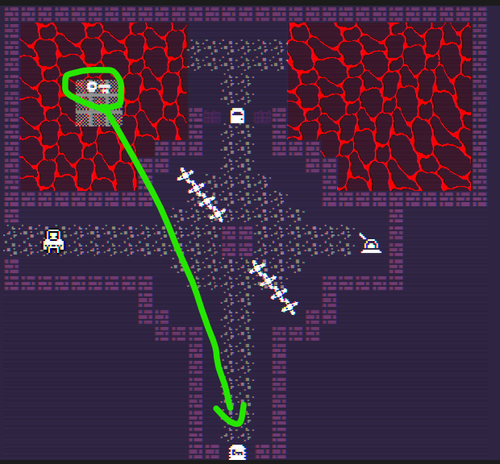
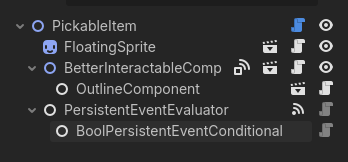
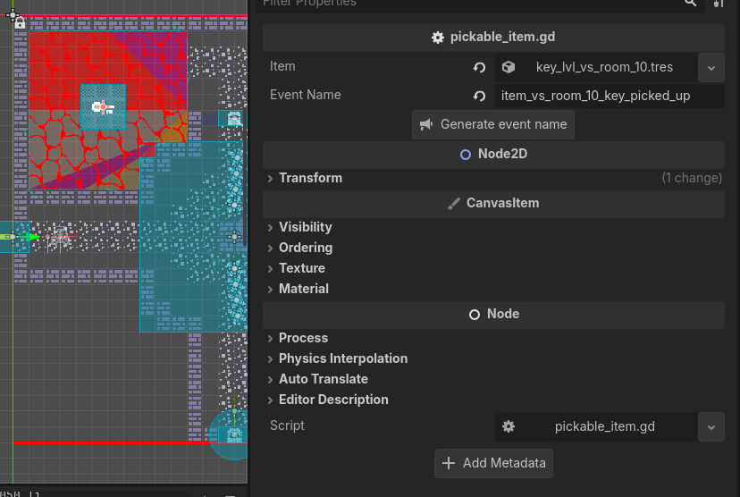
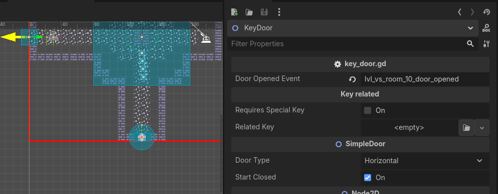
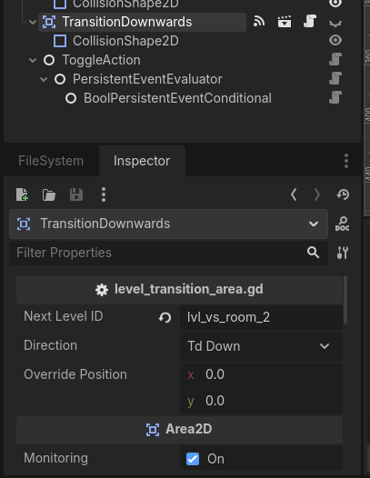
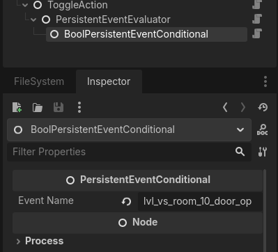
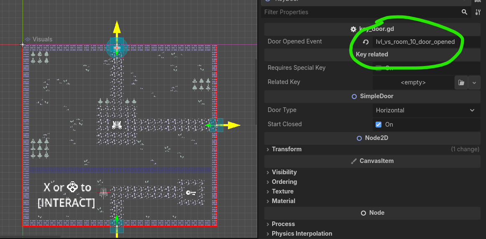

# Persistency System

Some actions taken by the player are meant to be persistent. When they open certain doors, or they interact with certain
objects in the map, the state of the world changes.

This doc explains the implementation behind said idea.

## Implementation

### What is an event?

This system is modeled after "persistent events". Persistent events are nothing more than a key and a value. The value represents the state of said event.
```py
# persistent_event.gd
class_name PersistentEvent

var name : String
var value : float

func _init(ev_name : String, ev_value : float = 0.0):
    name = ev_name
    value = ev_value
```

Internally, this events are stored in the save file as a dictionary. The idea is that, since these events are permanent, we can save them without issues and then use their value anytime they are needed. This also helps with mantaining the state after a run finishes, since the progress is stored on the save file.

```py
# custom_saved_game.gd
extends IndieBlueprintSavedGame
class_name ASavedGame

@export var persistent_events : Dictionary[String,float]
```
### What is an evaluator?

An evaluator simply checks if a series of events have happened, and executes some code if this is the case. The events are checked by **conditionals**, that return true or false based on different situations.

For example, say i want to open a door with a lever. When the player interacts with the lever:
1. The lever changes the world state with an event called "lever_x_used"
2. The evaluator is notified of this change, and checks if the state change is related to itself
    1. The evaluator has a conditional node that returns true if "lever_x_used" exists and has a value of 1
3. If the evaluator succedes, the door is opened. Since the event is stored on the save, the door will remain open.

> Note that an evaluator requires all conditionals to be true to succeed.

### What is a conditional?

As explained on the previous section, its an object that checks for a particular event and returns true or false based on that information.

```py
# event_conditional.gd
extends Node
class_name PersistentEventConditional

@export var event_name : String

func evaluate(_cached_events : Dictionary[String,float] = {}) -> bool:
    return true
```

The most basic conditional is the bool conditional, that returns `true` when the value of the event is 1, and `false` otherwise.

```py
# bool_event_conditional.gd
extends PersistentEventConditional

func evaluate(cached_events : Dictionary = {}) -> bool:
	var ev: = get_event(cached_events)
	if not ev:
		return false
	return ev.value == 1.0
```

# How to use?

## Creating an event

You can create an event by using the `set_event(ev_name, ev_value)` method in the `PersistencySystem` class

```py
func your_code():
    PersistencySystem.set_event("lever_x_used",1.0)
```

This will call a global event called `event_set(event, cached_events)`, which can be found on the `GlobalSignal` class.

```py
func _ready():
    GlobalSignal.event_set.connect(_on_event_set)

func _on_event_set(
        ev : PersistentEvent, # the created event
        cached_events : Dictionary[String,float] # a dictionary of current events. used to avoid reading the save file multiple times when evaluating conditions
    ):
    pass
```

## Using an event evaluator

Event evaluators are nodes, and so they can be instantiated by adding them as childs of other nodes.

There are 2 types of evaluators:

- All true: all conditionals must be true to succeed
- Any is true: at least 1 conditional must be true to succeed

They contain 2 events:

- evaluator_succeeded(): called when the evaluator succeeds (based on the types explained before)
- evaluator_failed(): called otherwise

## Using event conditionals

> Note: this section is based on the setup for the [lvl_vs_room_10](../level_system/levels/level_vertical_slice/lvl_vs_room_10.tscn) level.

Event conditionals are also nodes, and must be added as **childs of an event evaluator**.

Condionals evaluate a particular [event](#creating-an-event) and return false or true based on their value.

## Actions

Actions are used to model common situations related to events. For example, a [toggle action](./actions/toggle_action.gd) changes the visibility of a node based on the result of an evaluator.

## Example: Opening a door with a key

Lets say we want to open a door that requires a key. There are a number of interesting events that happen in this case:

- We want to know if we have picked up the necessary key or not
- We want to know if we used the key to open the door.



### Setting up the key

First, we add the key. We can use the [Pickable Item](../inventory_system/pickable_item/pickable_item.gd) scene, that already has the setup for the evaluator and the conditional.



Picking up an item will save a new "pick up" event. This helps us keep track of the items in the world. Pickable items are also setup to be deleted when this event is true.



### Setting up the door

Doors have a similar setup. We can add the [Key Door](../doors/key_door.gd) scene, which takes an event as a parameter. This event represents that the door has been opened.



### Setting up the action

Once we have the door and the key, we want to toggle the transition area depending on wether the door is open or not.

We can add a [toggle action](./actions/toggle_action.gd) node, and set the transition area as the target. Then, we want to set the conditional to evaluate the "door opened" event.





Now our setup is finished. With it we will:

- Create an event when we pick up a key
- Create an event when we open a door
- Toggle a transition area when we open a door

As a bonus, since this door separates levels, we can also add a similar door on the level we are transitioning to, and set its event to `door opened` event we created earlier. This way, that door will also be opened.



